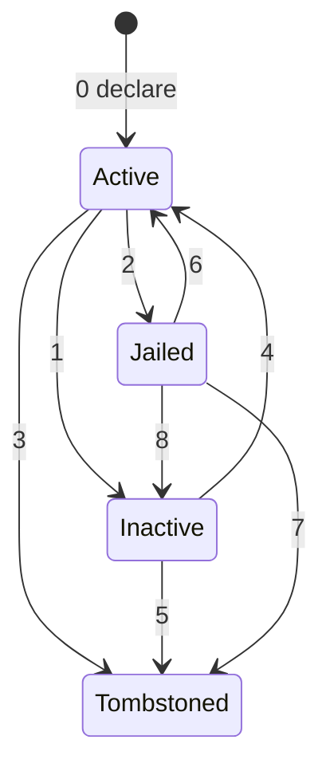

# Validator Status Tracking

This page documents how the enrollment chain tracks validator status, how validators are
jailed for downtime and tombstoned for equivocation, and how jailed validators
are automatically unjailed once their uptime recovers.

## The four states

Every validator the chain has ever seen is in exactly one of four states,
tracked in the consensus state under the key
`current/validator_status/{pub_key_hex}`:

| State        | Meaning                                                            |
| ------------ | ------------------------------------------------------------------ |
| `Active`     | Participating in consensus at full voting power.                   |
| `Inactive`   | Removed from the on-chain `Config` by admins, can be re-added.     |
| `Jailed`     | Temporarily removed for excessive downtime, can be auto unjailed.  |
| `Tombstoned` | Permanently banned for equivocation (double-signing). Terminal.    |

`Tombstoned` is the only terminal state. `Inactive` and `Jailed` are both
recoverable: `Inactive -> Active` requires an
admin action (re-adding the validator to `Config`), whereas `Jailed -> Active`
happens automatically when the validator's uptime recovers.

## State machine



All eight transitions are driven from the ABCI `FinalizeBlock` handler.

| #   | Transition              | Trigger                                                  | Handler                                                        |
| --- | ----------------------- | -------------------------------------------------------- | -------------------------------------------------------------- |
| 0   | `Active`            | Validator declared, or migration on first sync           | `State::declare_validator`, `sync_validators_from_config`      |
| 1   | `Active -> Inactive`     | Validator absent from a new `Config`                     | `sync_validators_from_config`                                  |
| 2   | `Active -> Jailed`       | Missed blocks in window exceed `missed_blocks_max`       | `jail_inactive_validators`                                     |
| 3   | `Active -> Tombstoned`   | Equivocation evidence in `FinalizeBlock.misbehavior`     | `tombstone_validator`                                          |
| 4   | `Inactive -> Active`     | Validator re-added to `Config`                           | `sync_validators_from_config`                                  |
| 5   | `Inactive -> Tombstoned` | Late equivocation evidence for a removed validator       | `tombstone_validator`                                          |
| 6   | `Jailed -> Active`       | Missed blocks fall to or below `unjail_missed_max`              | `jail_inactive_validators`                                     |
| 7   | `Jailed -> Tombstoned`   | Equivocation evidence for a jailed validator             | `tombstone_validator`                                          |
| 8   | `Jailed -> Inactive`     | Validator removed from `Config` while jailed             | `sync_validators_from_config`                                  |

## Power levels

The chain uses three distinct power levels:

| Power                    | Meaning in state                                           |
| ------------------------ | ---------------------------------------------------------- |
| `BASE_VALIDATOR_POWER`   | `Active` - full voting weight.                             |
| `1`                      | `Jailed` - still in the CometBFT validator set, but ~0.    |
| `0`                      | `Inactive` or `Tombstoned` - removed from CometBFT's validator set.  |

`BASE_VALIDATOR_POWER` is defined as `1_000_000_000`. That value is
chosen so that:

- A jailed validator's power of `1` is negligible relative to an active
  validator, so it contributes essentially nothing to vote tallies.
- The base power fits within `i32::MAX`, leaving headroom for arithmetic.
- Total power across a large validator set stays well within CometBFT's
  `i64::MAX / 8` ceiling.

Jailed validator power of 1 is an unusual design choice, done to enable
automatic unjailing without operator intervention.

If a jailed validator's power dropped to `0`, CometBFT would stop including
them in the validator set, and consequently we would stop receiving their
votes in `FinalizeBlock`. With no signal, we could never tell that their node
came back online - unjailing would have to be a manual, signed transaction.

By keeping jailed validators at power = `1`, CometBFT continues to request
their votes. Those votes (or absences) feed the uptime tracker, and once the
missed block count drops to or below `unjail_missed_max`, they are
restored to `BASE_VALIDATOR_POWER`.

The tradeoff is that jailed nodes stay in the validator set, albeit with power
so low they cannot meaningfully influence consensus.

## Bitvec-based uptime tracker

Per-validator uptime is tracked with a fixed-size bit ring buffer, one bit per
block: `1` if the validator signed, `0` if they missed.

```rust
struct Uptime {
    as_of_block_height: u64,
    bits: BitVec<u8, Lsb0>,
}
```

The struct is persisted per validator under `current/validator_uptime/{pub_key_hex}`.

[bitvec]: https://docs.rs/bitvec

Blocks are written at index `height % window_len`. New writes overwrite the
oldest entry in place. The window length is
`ValidatorConfig.uptime_window` (default `10_000`).

On construction and on `Inactive -> Active` reactivation, the bitvec is
initialised to all `1`s. That gives a new or re-added validator a full window
worth of credit, so they cannot be jailed during their first few blocks
simply for not having existed yet.

Uptime records use a small custom little-endian binary encoding:

| Offset        | Field                 | Type  |
| ------------- | --------------------- | ----- |
| `0..8`        | `as_of_block_height`  | `u64` |
| `8..12`       | `window_len`          | `u32` |
| `12..`        | bitvec bytes          | `ceil(window_len / 8)` bytes |

## Deadband: jailing vs. unjailing

Two thresholds in `ValidatorConfig` decide when a validator crosses
between `Active` and `Jailed`:

| Field                | Default  | Meaning                                                   |
| -------------------- | -------- | --------------------------------------------------------- |
| `uptime_window`      | `10_000` | Window size in blocks.                                    |
| `missed_blocks_max`  | `500`    | Jail if misses in window exceed this.                 |
| `unjail_missed_max`  | `250`    | Unjail if misses in window are at or below this.      |

Using a single threshold `T` would cause a validator hovering near `T` to
flip-flop between `Active` and `Jailed` on every block - each flip emitting a
validator set update to CometBFT.

The deadband between `unjail_missed_max` and `missed_blocks_max` ensures that
once jailed, a validator must recover meaningfully (not just
sign one extra block) before being returned to full power. With the defaults,
a validator is jailed once they have missed more than 500 out of 10 000
blocks, and only unjailed once they have recovered to 250 or fewer misses.
